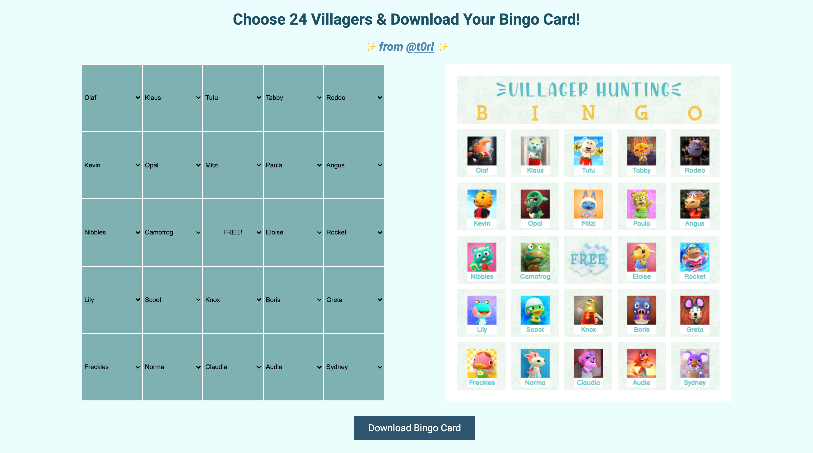

# Animal Crossing New Horizons Bingo Card Generator
Create your own bingo card for villager hunting in Animal Crossing New Horizons.

Vanilla HTML, CSS, and JS project.

### To Do
- Add mobile compatibility to v3 (show/download random generated card only)
- ~Add randomize feature~ :white_check_mark: v3
- ~Fix bug that causes name of first villager selected to be off center~  :white_check_mark: v3

## Changes
### v3

v3 (`/refactor`) refactored in 2 days.

- added randomize feature
- updated file structure
- updated to class-based files
- fixed uncentered text bug

### v2

v2 (`/ui-enhancement`) designed and built in 2 days.

- complete redesign of application
- able to view villagers before selection
- added easier UX for card creation

### v1

v1 (original `/master` branch) built in a day.

## Credit

Fonts: [Fink Heavy](https://www.fontsmarket.com/font-download/fink-heavy), [Klepon-Ijo](https://www.dafont.com/klepon-ijo)

APIs: [ACNH API](http://acnhapi.com/)
